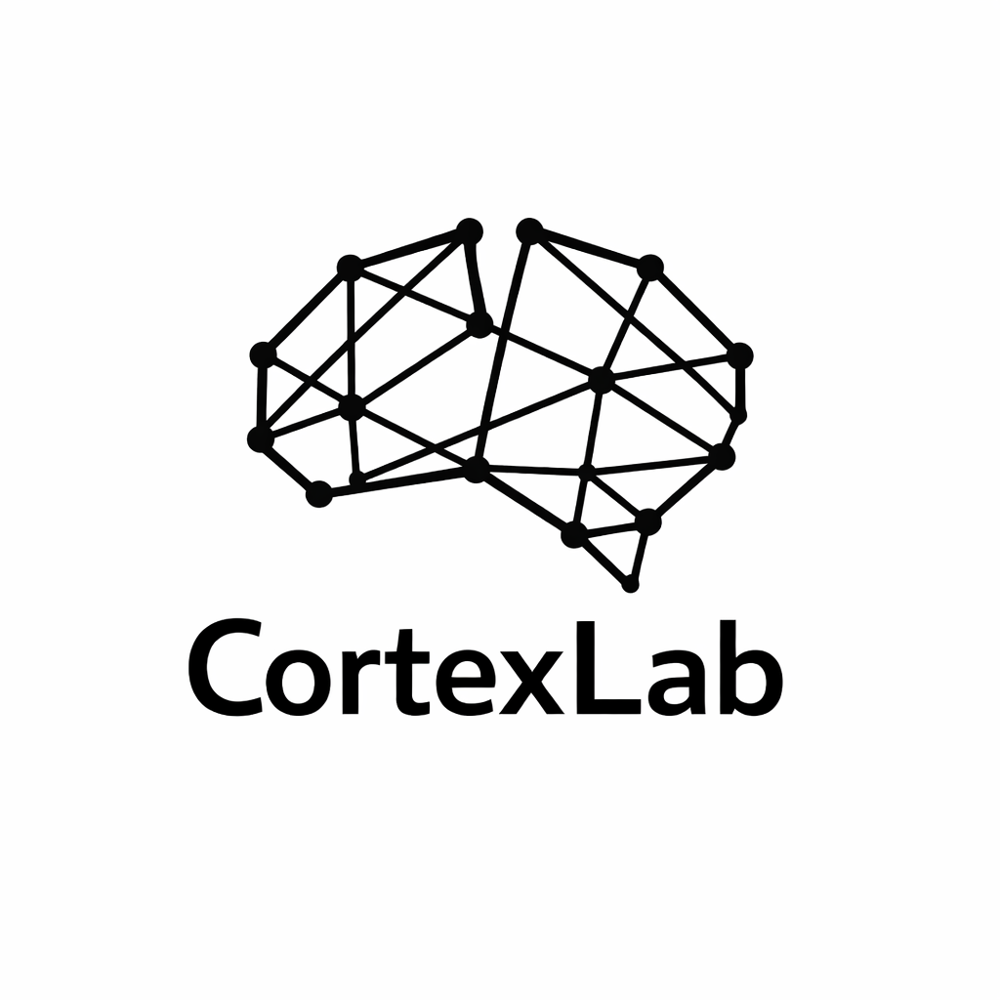

# CortexLab

CortexLab is a desktop-first, open-source cognitive training engine built in Go and GIO.

It provides research-oriented implementations of validated cognitive tasks with precise timing, reproducible training protocols, and full raw-data export.

CortexLab is not a game.  
It is an instrument.

## Philosophy

CortexLab is designed around the following principles:

- Evidence-informed task design
- Analytics-first architecture
- Reproducible experimental protocols
- Raw trial-level data export
- Privacy by default (local-first)
- No gamification, no dark patterns

The goal is to provide a transparent and extensible cognitive training and measurement platform suitable for serious users, researchers, and engineers.

---

## Scientific Scope

CortexLab focuses on experimentally validated cognitive domains:

- Working memory
- Short-term memory
- Executive control
- Attention
- Processing speed
- Learning and retention

Included tasks (MVP roadmap):

- N-Back (visual & auditory)
- Digit Span (forward & backward)
- Stroop Task
- Reaction Time (simple & choice)

Each task logs:

- Trial-level accuracy
- Reaction time (ms precision)
- Difficulty level
- Session metadata
- Timestamped events

All raw data can be exported as CSV or JSON.

## Design Principles

### 1. Reproducibility

All training sessions are defined by explicit protocol configurations.

Example:

```json
{
  "exercise": "n-back",
  "n": 3,
  "trials": 200,
  "stimulus_interval_ms": 2000,
  "seed": 12345
}
```

The same protocol produces identical stimulus sequences.

### 2. Analytics from Day One

CortexLab provides:

- Accuracy metrics
- Reaction time distributions
- Learning curves
- Session comparisons
- Longitudinal tracking

Raw data is always preserved.

### 3. Transparency

CortexLab makes no claims about increasing IQ or general intelligence.

Improvements observed in tasks may reflect task-specific learning.
Transfer effects are not assumed and must be **empirically evaluated**.


## Architecture

CortexLab is structured as a modular engine:

```
/cmd/app
/internal/core
/internal/exercises
/internal/analytics
/internal/storage
/ui
```

Exercises implement a shared interface:

- Deterministic protocol definition
- Stimulus generation
- Response capture
- Metric reporting

The UI layer (GIO) is strictly separated from task logic.

## Technology Stack

- Go
- GIO (cross-platform desktop GUI)
- Local storage (SQLite or BoltDB)
- AGPLv3 license


## License

CortexLab is licensed under the GNU Affero General Public License v3 (AGPLv3).

This ensures that modified versions used over a network must also provide source code to users.

See LICENSE for details.

## Target Audience

- Researchers interested in reproducible cognitive experiments
- Engineers building cognitive measurement tools
- Serious individuals tracking cognitive performance
- Open-source contributors interested in cognitive science

## Non-Goals

CortexLab does not aim to:

- Provide medical diagnosis
- Replace clinical neuropsychological assessment
- Guarantee cognitive enhancement
- Compete with gamified brain-training apps

## Contributing

Contributions are welcome.

Before submitting a new exercise:

- Provide references to the cognitive paradigm
- Describe expected metrics
- Ensure deterministic protocol support
- Include documentation

## Why CortexLab?

Most cognitive training tools prioritize engagement (*and your money of course*).

CortexLab prioritizes:

- Measurement
- Transparency
- Reproducibility
- Scientific clarity

It is designed as a foundation for long-term cognitive tracking and research-grade experimentation.

## Status

Early development.
API and architecture may evolve.
